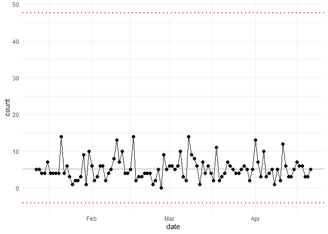

<!-- README.md is generated from README.Rmd. Please edit that file -->

# healthyR.ai 

<!-- badges: start -->

[](https://cran.r-project.org/package=healthyR.ai)


[](https://lifecycle.r-lib.org/articles/stages.html#experimental)
[](http://makeapullrequest.com)
<!-- badges: end -->

The goal of healthyR.ai is to …

## Installation

You can install the released version of healthyR.ai from
[CRAN](https://CRAN.R-project.org) with:

``` r
install.packages("healthyR.ai")
```

And the development version from [GitHub](https://github.com/) with:

``` r
# install.packages("devtools")
devtools::install_github("spsanderson/healthyR.ai")
```

## Example

This is a basic example which shows you how to solve a common problem:

``` r
library(healthyR.ai)
#> == Welcome to healthyR.ai ======================================================
#> If you find this package useful, please leave a star: https://github.com/spsanderson/healthyR.ai
#> If you encounter a bug or want to request an enhancement please file an issue at:
#>    https://github.com/spsanderson/healthyR.ai/issues
#> Thank you for using healthyR.ai!
library(ggplot2)

data_tbl <- tibble::tibble(
        day = sample(c("Monday", "Tuesday", "Wednesday", "Thursday", "Friday"),
                     100, TRUE),
        person = sample(c("Tom", "Jane", "Alex"), 100, TRUE),
        count = rbinom(100, 20, ifelse(day == "Friday", .5, .2)),
        date = Sys.Date() - sample.int(100))

my_chart <- hai_control_chart(data_tbl, count, date)
#> Registered S3 method overwritten by 'quantmod':
#>   method            from
#>   as.zoo.data.frame zoo
```



``` r
my_chart +
    ylab("Number of Adverse Events") +
    scale_x_date(name = "Week of ... ", date_breaks = "week") +
    theme(axis.text.x = element_text(angle = -90, vjust = 0.5, hjust=1))
```


