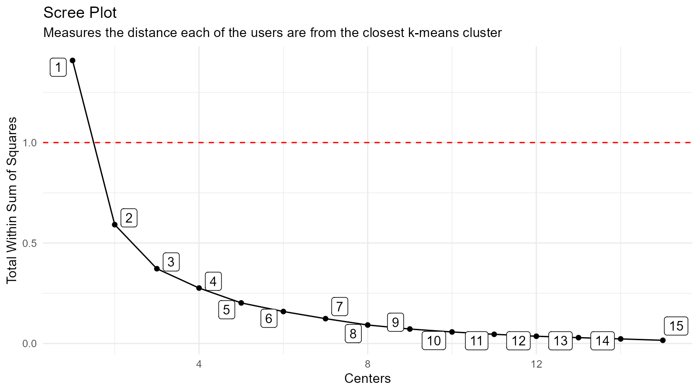
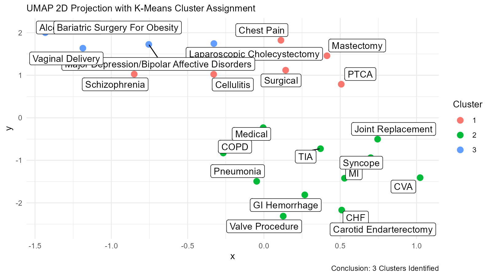

# Clustering with K-Means and UMAP

> healthyR.ai: A toolkit for hospital data \# Libaray Load

First things first, lets load in the library:

``` r
library(healthyR.ai)
```

## Information

K-Means is a partition algorithm initially designed for signal
processing. The goal is to partition *`n`* observations into *`k`*
clusters where each *`n`* is in *`k`*. The unsupervised k-means
algorithm has a loose relationship to the k-nearest neighbor classifier,
a popular supervised machine learning technique for classification that
is often confused with k-means due to the name. Applying the 1-nearest
neighbor classifier to the cluster centers obtained by k-means
classifies new data into the existing clusters.

The aim of this vignette is to showcase the use of the `healthyR`
wrapper for the `kmeans` function the the wrapper and plot for the
[`uwot::umap`](https://jlmelville.github.io/uwot/reference/umap.html)
projection function. We will go through the entire workflow from getting
the data to getting the fina `UMAP` plot.

## Generate some data

``` r
library(healthyR.data)
library(dplyr)
library(broom)
library(ggplot2)

data_tbl <- healthyR_data %>%
    filter(ip_op_flag == "I") %>%
    filter(payer_grouping != "Medicare B") %>%
    filter(payer_grouping != "?") %>%
    select(service_line, payer_grouping) %>%
    mutate(record = 1) %>%
    as_tibble()

data_tbl %>%
  glimpse()
#> Rows: 116,823
#> Columns: 3
#> $ service_line   <chr> "Medical", "Schizophrenia", "Syncope", "Pneumonia", "Ch…
#> $ payer_grouping <chr> "Blue Cross", "Medicare A", "Medicare A", "Medicare A",…
#> $ record         <dbl> 1, 1, 1, 1, 1, 1, 1, 1, 1, 1, 1, 1, 1, 1, 1, 1, 1, 1, 1…
```

Now that we have our data we need to generate what is called a user item
table. To do this we use the function *`hai_kmeans_user_item_tbl`* which
takes in just a few arguments. The purpose of the user item table is to
aggregate and normalize the data between the users and the items.

The data that we have generated is going to look for clustering amongst
the *`service_lines`* (the user) and the *`payer_grouping`* (item)
columns.

Lets now create the user item table.

## User Item Tibble

``` r
uit_tbl <- hai_kmeans_user_item_tbl(data_tbl, service_line, payer_grouping, record)
uit_tbl
#> # A tibble: 23 × 12
#>    service_line     `Blue Cross` Commercial Compensation `Exchange Plans`    HMO
#>    <chr>                   <dbl>      <dbl>        <dbl>            <dbl>  <dbl>
#>  1 Alcohol Abuse          0.0941    0.0321      0.000525          0.0116  0.0788
#>  2 Bariatric Surge…       0.317     0.0583      0                 0.0518  0.168 
#>  3 CHF                    0.0295    0.00958     0.000518          0.00414 0.0205
#>  4 COPD                   0.0493    0.0228      0.000228          0.00548 0.0342
#>  5 CVA                    0.0647    0.0246      0.00107           0.0107  0.0524
#>  6 Carotid Endarte…       0.0845    0.0282      0                 0       0.0141
#>  7 Cellulitis             0.110     0.0339      0.0118            0.00847 0.0805
#>  8 Chest Pain             0.144     0.0391      0.00290           0.00543 0.112 
#>  9 GI Hemorrhage          0.0542    0.0175      0.00125           0.00834 0.0480
#> 10 Joint Replaceme…       0.139     0.0179      0.0336            0.00673 0.0516
#> # ℹ 13 more rows
#> # ℹ 6 more variables: Medicaid <dbl>, `Medicaid HMO` <dbl>, `Medicare A` <dbl>,
#> #   `Medicare HMO` <dbl>, `No Fault` <dbl>, `Self Pay` <dbl>
```

The table is aggregated by item for the various users to which the
algorithm will be applied.

Now that we have this data we need to find what will be out optimal k
(clusters). To do this we need to generate a table of data that will
have a column of k and for that k apply the k-means function to the data
with that k and return the **`total within sum of squares`**.

To do this there is a convienent function called
*`hai_kmeans_mapped_tbl`* that takes as its sole argument the output
from the *`hai_kmeans_user_item_tbl`*. There is an argument *`.centers`*
where the default is set to 15.

## K-Means Mapped Tibble

``` r
kmm_tbl <- hai_kmeans_mapped_tbl(uit_tbl)
kmm_tbl
#> # A tibble: 15 × 3
#>    centers k_means  glance          
#>      <int> <list>   <list>          
#>  1       1 <kmeans> <tibble [1 × 4]>
#>  2       2 <kmeans> <tibble [1 × 4]>
#>  3       3 <kmeans> <tibble [1 × 4]>
#>  4       4 <kmeans> <tibble [1 × 4]>
#>  5       5 <kmeans> <tibble [1 × 4]>
#>  6       6 <kmeans> <tibble [1 × 4]>
#>  7       7 <kmeans> <tibble [1 × 4]>
#>  8       8 <kmeans> <tibble [1 × 4]>
#>  9       9 <kmeans> <tibble [1 × 4]>
#> 10      10 <kmeans> <tibble [1 × 4]>
#> 11      11 <kmeans> <tibble [1 × 4]>
#> 12      12 <kmeans> <tibble [1 × 4]>
#> 13      13 <kmeans> <tibble [1 × 4]>
#> 14      14 <kmeans> <tibble [1 × 4]>
#> 15      15 <kmeans> <tibble [1 × 4]>
```

As we see there are three columns, `centers`, `k_means` and `glance`.
The k_means column is the `k_means` list object and `glance` is the
tibble returned by the
[`broom::glance`](https://generics.r-lib.org/reference/glance.html)
function.

``` r
kmm_tbl %>%
  tidyr::unnest(glance)
#> # A tibble: 15 × 6
#>    centers k_means  totss tot.withinss betweenss  iter
#>      <int> <list>   <dbl>        <dbl>     <dbl> <int>
#>  1       1 <kmeans>  1.41       1.41    1.33e-15     1
#>  2       2 <kmeans>  1.41       0.592   8.17e- 1     1
#>  3       3 <kmeans>  1.41       0.372   1.04e+ 0     3
#>  4       4 <kmeans>  1.41       0.276   1.13e+ 0     2
#>  5       5 <kmeans>  1.41       0.202   1.21e+ 0     3
#>  6       6 <kmeans>  1.41       0.159   1.25e+ 0     4
#>  7       7 <kmeans>  1.41       0.124   1.28e+ 0     3
#>  8       8 <kmeans>  1.41       0.0922  1.32e+ 0     3
#>  9       9 <kmeans>  1.41       0.0722  1.34e+ 0     3
#> 10      10 <kmeans>  1.41       0.0576  1.35e+ 0     3
#> 11      11 <kmeans>  1.41       0.0460  1.36e+ 0     2
#> 12      12 <kmeans>  1.41       0.0363  1.37e+ 0     3
#> 13      13 <kmeans>  1.41       0.0293  1.38e+ 0     2
#> 14      14 <kmeans>  1.41       0.0231  1.39e+ 0     2
#> 15      15 <kmeans>  1.41       0.0161  1.39e+ 0     2
```

As stated we use the `tot.withinss` to decide what will become our
*`k`*, an easy way to do this is to visualize the Scree Plot, also known
as the elbow plot. This is done by ploting the `x-axis` as the `centers`
and the `y-axis` as the `tot.withinss`.

## Scree Plot and Data

``` r
hai_kmeans_scree_plt(.data = kmm_tbl)
```



If we want to see the scree plot data that creates the plot then we can
use another function `hai_kmeans_scree_data_tbl`.

``` r
hai_kmeans_scree_data_tbl(kmm_tbl)
#> # A tibble: 15 × 2
#>    centers tot.withinss
#>      <int>        <dbl>
#>  1       1       1.41  
#>  2       2       0.592 
#>  3       3       0.372 
#>  4       4       0.276 
#>  5       5       0.202 
#>  6       6       0.159 
#>  7       7       0.124 
#>  8       8       0.0922
#>  9       9       0.0722
#> 10      10       0.0576
#> 11      11       0.0460
#> 12      12       0.0363
#> 13      13       0.0293
#> 14      14       0.0231
#> 15      15       0.0161
```

With the above pieces of information we can decide upon a value for
*`k`*, in this instance we are going to use 3. Now that we have that we
can go ahead with creating the umap list object where we can take a look
at a great many things associated with the data.

## UMAP List Object

Now lets go ahead and create our UMAP list object.

``` r
ump_lst <- hai_umap_list(.data = uit_tbl, kmm_tbl, 3)
```

Now that it is created, lets take a look at each item in the list. The
`umap_list` function returns a list of 5 items.

- umap_obj
- umap_results_tbl
- kmeans_obj
- kmeans_cluster_tbl
- umap_kmeans_cluster_results_tbl

Since we have the list object we can now inspect the `kmeans_obj`, first
thing we will do is use the `hai_kmeans_tidy_tbl` function to inspect
things.

``` r
km_obj <- ump_lst$kmeans_obj
hai_kmeans_tidy_tbl(.kmeans_obj = km_obj, .data = uit_tbl, .tidy_type = "glance")
#> # A tibble: 1 × 4
#>   totss tot.withinss betweenss  iter
#>   <dbl>        <dbl>     <dbl> <int>
#> 1  1.41        0.372      1.04     3
hai_kmeans_tidy_tbl(km_obj, uit_tbl, "augment")
#> # A tibble: 23 × 2
#>    service_line                  cluster
#>    <chr>                         <fct>  
#>  1 Alcohol Abuse                 3      
#>  2 Bariatric Surgery For Obesity 3      
#>  3 CHF                           2      
#>  4 COPD                          2      
#>  5 CVA                           2      
#>  6 Carotid Endarterectomy        2      
#>  7 Cellulitis                    1      
#>  8 Chest Pain                    1      
#>  9 GI Hemorrhage                 2      
#> 10 Joint Replacement             2      
#> # ℹ 13 more rows
hai_kmeans_tidy_tbl(km_obj, uit_tbl, "tidy")
#> # A tibble: 3 × 14
#>   `Blue Cross` Commercial Compensation `Exchange Plans`    HMO Medicaid
#>          <dbl>      <dbl>        <dbl>            <dbl>  <dbl>    <dbl>
#> 1       0.117      0.0314     0.0102            0.0139  0.0982   0.0856
#> 2       0.0784     0.0218     0.00432           0.00620 0.0449   0.0368
#> 3       0.150      0.0368     0.000307          0.0207  0.163    0.131 
#> # ℹ 8 more variables: `Medicaid HMO` <dbl>, `Medicare A` <dbl>,
#> #   `Medicare HMO` <dbl>, `No Fault` <dbl>, `Self Pay` <dbl>, size <int>,
#> #   withinss <dbl>, cluster <fct>
```

## UMAP Plot

Now that we have all of the above data we can visualize our clusters
that are colored by their cluster number.

``` r
hai_umap_plot(.data = ump_lst, .point_size = 3, TRUE)
```


